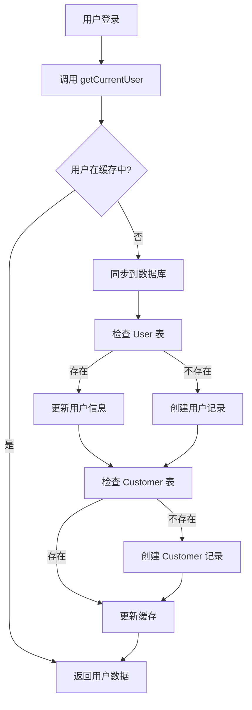

# 用户数据同步指南

## 🎯 问题解决

本方案解决了 **Neon 数据库无用户数据** 的问题。

### 根本原因
1. Clerk Webhook 只在 `user.created` 或 `user.updated` 事件时触发
2. 已存在的用户登录时不会触发这些事件
3. 如果 Webhook 是在用户创建后才配置的，之前的用户数据不会同步

## 🚀 解决方案

### 1. 自动同步机制（已实现）

**每次调用 `getCurrentUser()` 时会自动同步用户数据到数据库**

- 文件：`packages/auth/index.ts`
- 同步逻辑：`packages/auth/src/sync-user.ts`
- 包含 5 分钟缓存，避免频繁数据库操作

### 2. 同步现有用户

对于已存在的 Clerk 用户，有三种方式同步到数据库：

#### 方法 A：自动同步（推荐）
用户下次登录并访问任何需要认证的页面时，会自动同步。

#### 方法 B：手动触发 API
访问 `/api/sync-current-user` 端点：
```bash
curl https://your-domain.vercel.app/api/sync-current-user
```

#### 方法 C：批量同步脚本
运行批量同步脚本，同步所有 Clerk 用户：
```bash
# 本地运行
cd /path/to/saasfly
bun run scripts/sync-all-users.ts

# 或在生产环境运行（需要设置环境变量）
CLERK_SECRET_KEY=your_key POSTGRES_URL=your_db_url bun run scripts/sync-all-users.ts
```

## 📊 数据同步流程



## 🔧 技术细节

### 同步的数据
- **User 表**：id, email, name, image, emailVerified
- **Customer 表**：authUserId, name, plan (默认 FREE)

### 缓存机制
- 缓存时间：5 分钟
- 缓存位置：内存（Node.js 进程）
- 清理：自动过期

### 错误处理
- 同步失败不会影响用户登录
- 错误会记录到控制台日志
- API 端点会返回详细错误信息

## 🚨 重要提示

1. **首次部署后**：运行批量同步脚本，确保所有现有用户都同步到数据库
2. **Webhook 仍然重要**：保持 Clerk Webhook 配置，处理用户创建、更新、删除事件
3. **监控日志**：定期检查控制台日志，确保同步正常工作

## 📝 验证同步

### 检查数据库
```sql
-- 查看所有用户
SELECT * FROM "User";

-- 查看所有客户
SELECT * FROM "Customer";

-- 检查特定用户
SELECT * FROM "User" WHERE email = 'user@example.com';
```

### 测试同步
1. 登录应用
2. 访问 `/api/sync-current-user`
3. 检查响应和数据库

## 🐛 故障排查

### 问题：用户登录但数据库无记录
1. 检查环境变量 `POSTGRES_URL` 是否正确
2. 查看 Vercel Functions 日志
3. 手动访问 `/api/sync-current-user` 查看错误信息

### 问题：同步脚本失败
1. 确认 `CLERK_SECRET_KEY` 设置正确
2. 确认数据库连接正常
3. 检查 Clerk Dashboard 中的 API 配额

## 📚 相关文件

- 自动同步：`packages/auth/index.ts`
- 同步逻辑：`packages/auth/src/sync-user.ts`
- API 端点：`apps/nextjs/src/app/api/sync-current-user/route.ts`
- 批量脚本：`scripts/sync-all-users.ts`
- Webhook：`apps/nextjs/src/app/api/webhooks/clerk/route.ts`